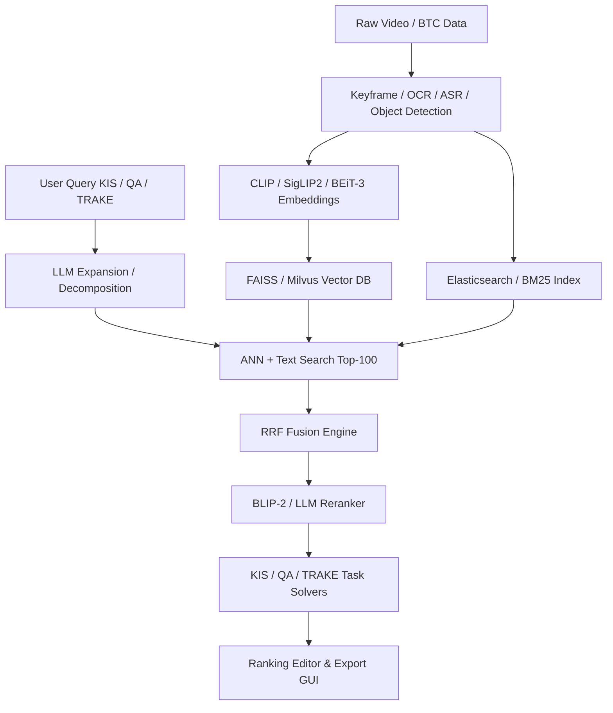

# Architecture Diagram & Data Flow

```mermaid
flowchart TD
    RawData[Raw Video / BTC Data] --> Preprocessing[Keyframe / OCR / ASR / Object Detection]
    Preprocessing --> Embeddings[CLIP / SigLIP2 / BEiT-3 Embeddings]
    Preprocessing --> TextIndex[Elasticsearch / BM25 Index]
    Embeddings --> VectorDB[FAISS / Milvus Vector DB]

    Query[User Query KIS / QA / TRAKE] --> QueryProcessor[LLM Expansion / Decomposition]
    QueryProcessor --> FirstStage[ANN + Text Search Top-100]
    VectorDB --> FirstStage
    TextIndex --> FirstStage

    FirstStage --> Fusion[RRF Fusion Engine]
    Fusion --> Reranker[BLIP-2 / LLM Reranker]
    Reranker --> TaskSolvers[KIS / QA / TRAKE Task Solvers]
    TaskSolvers --> UI[Ranking Editor & Export GUI]
```
